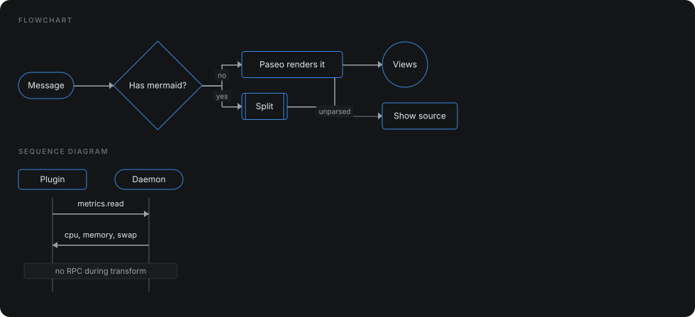
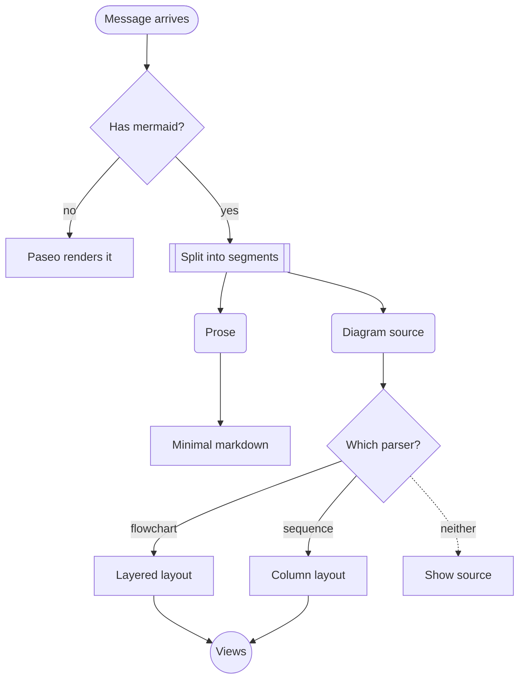

<h1 align="center">paseo-plugin-mermaid</h1>

<p align="center">
  Mermaid diagrams drawn inside the <a href="https://paseo.sh">Paseo</a> chat timeline.<br>
  When an agent replies with a <code>```mermaid</code> block, you get the drawing instead of the source.
</p>

<p align="center">
  
  
  
  
</p>

<p align="center">
  
</p>

<p align="center"><sub>Generated by <code>npm run preview</code>: the diagram above comes from the plugin&apos;s own parser and layout, so the picture cannot drift from the code.</sub></p>

Built on the plugin timeline API added in Paseo 0.7.

Paseo 0.7 draws Mermaid itself, in an iframe inside a zoomable box. This plugin
draws it inline instead: readable at the width of the message, at the moment the
message arrives, with no box to expand and no zoom to adjust. If you would rather
have the zoom, you do not need this plugin.

## Install

```sh
git clone https://github.com/dutchakdev/paseo-plugin-mermaid.git
cd paseo-plugin-mermaid
npm install
npm run typecheck && npm test
paseo plugin install "$PWD"
paseo plugin ls          # expect: running
```

Plugins must be enabled daemon-wide first, under **Settings → Plugins → Enable
plugins**.

## What it draws

| Diagram | Supported |
| ------- | --------- |
| `flowchart` / `graph` | `TD`, `TB`, `BT`, `LR`, `RL` |
| Node shapes | `[rect]`, `(round)`, `([stadium])`, `[[subroutine]]`, `{diamond}`, `((circle))`, `>asymmetric]` |
| Edges | `-->`, `---`, `-.->`,  `-.-`, `==>`, `===` |
| Edge labels | `-->|both|` and `-- forms -->` |
| `sequenceDiagram` | participants, actors, notes |
| Message arrows | `->`, `->>`, `-->`, `-->>`, `-x`, `--x`, `-)`, `--)` |

Not supported yet: subgraphs, `style`/`classDef` directives, and the diagram types
beyond these two. Unrecognised lines are counted and reported under the drawing
rather than dropped, and a diagram the parser cannot read at all falls back to
showing its source.

## How it works



Three constraints shaped this plugin.

**Mermaid itself cannot run here.** A Paseo client bundle may import only `react`,
`react-native`, `@tanstack/react-query`, `zod` and `@getpaseo/plugin`. There is no
SVG, no canvas and no webview, and Mermaid needs a DOM. So the parser, the layout
and the drawing are all written from scratch. Every line you see is a positioned
`View`: node boxes, edge segments 1.5px thick, and arrowheads made from a View
with three transparent borders.

**A transformer replaces the whole timeline entry.** Once a message contains a
diagram, the plugin owns the message. It is split into prose and diagram
segments, and each becomes its own item, so the text around the diagram keeps its
place. That prose goes through a small Markdown renderer covering headings,
lists, emphasis and code — less than Paseo's own, which is why messages without a
diagram are left alone entirely.

**Items store the source, not a parsed graph.** Parsing happens at render time.
The stored data stays small, and a later fix to the parser improves diagrams that
were sent months ago.

**The fence is claimed while it is still open.** A transformer that waits for the
closing ``` loses: the host renders `mermaid` fences too, and it starts as soon as
the fence opens. The message would arrive drawn by the host and only become this
plugin's on the next reprojection, which is why an unfinished block is taken over
immediately and drawn from whatever has parsed so far.

**The drawing is fitted to the row.** A diagram's natural size is whatever its
labels happened to add up to, which is no basis for how big it should appear. The
row is measured, the drawing is scaled to fit, small diagrams are grown a little
so they do not look lost, and shrinking stops at the point where labels would
stop being readable. Only past that does it scroll sideways.

## Development

```sh
npm run typecheck
npm test                 # 91 tests
paseo plugin reload mermaid
```

The parsers, the layout and the transform are pure functions with no runtime
dependencies, and that is where the tests are: bracket shapes, operator
precedence (`-.->` must never read as `-.-` plus a stray `>`), cycles in a
flowchart, node overlap, arrow direction, and the JSON round trip Paseo performs
on item data before rendering.

| File | Role |
| ---- | ---- |
| `segment.shared.ts` | splits a message into prose and diagram blocks |
| `flowchart.shared.ts` | flowchart parser |
| `sequence.shared.ts` | sequence diagram parser |
| `layout.shared.ts` | layered layout, orthogonal edge routing, column layout |
| `markdown.shared.ts` | the Markdown subset used for prose |
| `transform.shared.ts` | the timeline transform itself |
| `diagram.client.tsx` | drawing, in Views |
| `markdown.client.tsx` | prose rendering |

## License

MIT
